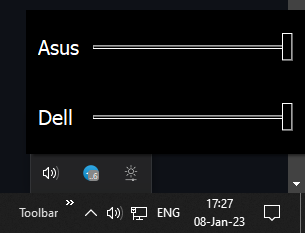

# BrightnessControl
## Overview

## Installation
- Download "BrightnessControl-vx.x.zip" from "Releases/" folder
- Download "BrightnessControl-vx.x.zip" from "Tags/Releases" section
## Usage
- Keep "BrightnessControl.exe" and "assets" in the same folder, "startup.sh" might be deleted
- [optional] Create shortcut to the "BrightnessControl.exe" file
- [optional] Add app to the startup running "startup.sh"
## FAQ
- Open "BrightnessControl.exe" to start the app in tray
- Mouse Right-click on tray icon to open the app
- Ctrl+Q while app is opened in tray to close the app
